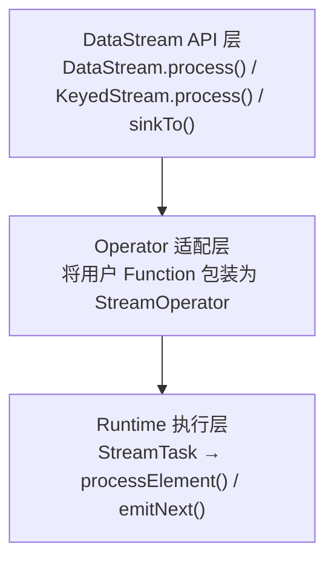
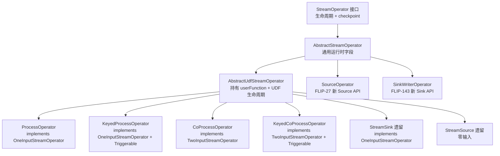
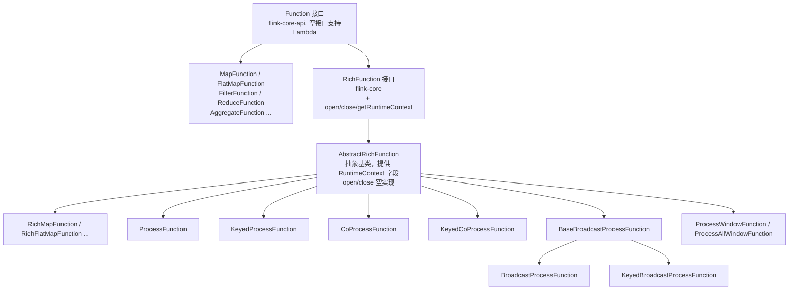
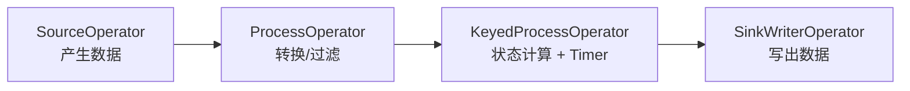
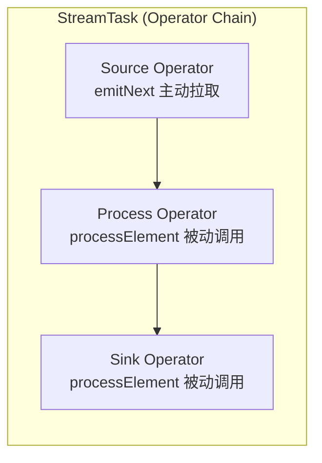

# Flink Operator 体系深度解析

## 一、总览：Operator 在 Flink 中的角色

在 Flink 的执行模型中，用户编写的 DataStream API 程序（如 `map()`、`process()`、`addSink()`）最终都会被翻译为 **StreamOperator**，由 Runtime 层的 StreamTask 驱动执行。Operator 是连接"用户逻辑"与"运行时引擎"的桥梁。



```
用户代码 (ProcessFunction / SinkFunction / Source)
        ↓ 包装
Operator 层 (ProcessOperator / SinkWriterOperator / SourceOperator)
        ↓ 调度执行
Runtime 层 (StreamTask → InputGate → processElement())
```

---

## 二、Operator 继承体系

### 2.1 核心接口与基类



文字版：

```
StreamOperator<OUT>                         [顶层接口，定义生命周期 + checkpoint]
  │
  ├── AbstractStreamOperator<OUT>           [抽象基类，持有运行时字段]
  │     │
  │     ├── AbstractUdfStreamOperator<OUT, F extends Function>
  │     │     │                             [持有 userFunction，管理 UDF 生命周期]
  │     │     │
  │     │     ├── ProcessOperator           [单输入，包装 ProcessFunction]
  │     │     ├── KeyedProcessOperator      [单输入 + Timer，包装 KeyedProcessFunction]
  │     │     ├── CoProcessOperator         [双输入，包装 CoProcessFunction]
  │     │     ├── KeyedCoProcessOperator    [双输入 + Timer]
  │     │     ├── StreamSink (遗留)         [单输入终端，包装 SinkFunction]
  │     │     └── StreamSource (遗留)       [零输入源头，包装 SourceFunction]
  │     │
  │     ├── SourceOperator (FLIP-27)        [新 Source API，零输入]
  │     └── SinkWriterOperator (FLIP-143)   [新 Sink API，单输入终端]
  │
  ├── OneInputStreamOperator<IN, OUT>       [单输入操作符接口]
  └── TwoInputStreamOperator<IN1, IN2, OUT> [双输入操作符接口]
```

### 2.2 关键基类职责

| 基类 | 职责 |
|---|---|
| `StreamOperator` | 定义 `open()`、`finish()`、`close()`、`snapshotState()` 等生命周期 |
| `AbstractStreamOperator` | 持有 `StreamTask`、`StreamConfig`、`Output`、`KeyedStateBackend` 等运行时字段 |
| `AbstractUdfStreamOperator` | 持有 `userFunction`；在 `setup()` 中注入 RuntimeContext；在 `open/close` 中管理 UDF 生命周期 |

---

## 三、Function 体系回顾



文字版：

```
Function (空接口，flink-core-api，支持 Lambda)
  │
  ├── MapFunction / FlatMapFunction / FilterFunction ...  [简单转换函数]
  ├── ReduceFunction / AggregateFunction                  [聚合函数]
  │
  └── RichFunction (接口，flink-core)
        │   + open(OpenContext) / close()
        │   + getRuntimeContext() / setRuntimeContext()
        │
        └── AbstractRichFunction (抽象类)
              │   持有 transient RuntimeContext
              │   提供 open/close 空实现
              │
              ├── RichMapFunction / RichFlatMapFunction ...
              ├── ProcessFunction<I, O>
              ├── KeyedProcessFunction<K, I, O>
              ├── CoProcessFunction<IN1, IN2, O>
              ├── KeyedCoProcessFunction<K, IN1, IN2, O>
              └── ProcessWindowFunction / ProcessAllWindowFunction
```

---

## 四、Process Operator 家族详解

### 4.1 ProcessOperator — 非 Keyed 单流处理

**文件位置**：`flink-runtime/.../operators/ProcessOperator.java`

```java
public class ProcessOperator<IN, OUT>
    extends AbstractUdfStreamOperator<OUT, ProcessFunction<IN, OUT>>
    implements OneInputStreamOperator<IN, OUT>
```

**核心执行逻辑**：

```java
// open() 阶段：初始化收集器和上下文
public void open() {
    collector = new TimestampedCollector<>(output);
    context = new ContextImpl(userFunction, getProcessingTimeService());
}

// 每条记录到来时：
public void processElement(StreamRecord<IN> element) {
    collector.setTimestamp(element);       // 传递时间戳
    context.element = element;            // 设置当前元素到 Context
    userFunction.processElement(element.getValue(), context, collector);
    context.element = null;               // 清理引用
}
```

**ContextImpl 提供的能力**：
- `timestamp()` — 当前元素时间戳
- `currentProcessingTime()` — 当前处理时间
- `currentWatermark()` — 当前水位线
- `output(OutputTag, value)` — 侧输出
- Timer 操作 → **抛出 UnsupportedOperationException**（非 Keyed 不支持）

**适用场景**：非 keyed 流的逐条处理，不需要 Timer 和 keyed state。

---

### 4.2 KeyedProcessOperator — Keyed 流处理 + Timer

**文件位置**：`flink-runtime/.../operators/KeyedProcessOperator.java`

```java
public class KeyedProcessOperator<K, IN, OUT>
    extends AbstractUdfStreamOperator<OUT, KeyedProcessFunction<K, IN, OUT>>
    implements OneInputStreamOperator<IN, OUT>, Triggerable<K, VoidNamespace>
```

**与 ProcessOperator 的关键区别**：

1. **实现 `Triggerable` 接口** — 支持 Timer 回调
2. **创建 `InternalTimerService`** — 管理事件时间/处理时间定时器
3. **Context 暴露 `getCurrentKey()`** — 用户可获取当前处理的 key

**核心执行逻辑**：

```java
public void open() {
    // 创建 Timer 服务
    InternalTimerService<VoidNamespace> internalTimerService =
        getInternalTimerService("user-timers", VoidNamespaceSerializer.INSTANCE, this);
    TimerService timerService = new SimpleTimerService(internalTimerService);
    
    context = new ContextImpl(userFunction, timerService);
    onTimerContext = new OnTimerContextImpl(userFunction, timerService);
}

// Timer 触发时的回调
public void onEventTime(InternalTimer<K, VoidNamespace> timer) {
    collector.setAbsoluteTimestamp(timer.getTimestamp());
    invokeUserFunction(TimeDomain.EVENT_TIME, timer);
}

public void onProcessingTime(InternalTimer<K, VoidNamespace> timer) {
    collector.eraseTimestamp();
    invokeUserFunction(TimeDomain.PROCESSING_TIME, timer);
}

private void invokeUserFunction(TimeDomain timeDomain, InternalTimer<K, VoidNamespace> timer) {
    onTimerContext.timeDomain = timeDomain;
    onTimerContext.timer = timer;
    userFunction.onTimer(timer.getTimestamp(), onTimerContext, collector);
}
```

**适用场景**：需要 keyed state、定时器（如超时检测、窗口逻辑、延迟触发）的流处理。

---

### 4.3 CoProcessOperator — 双流连接处理

**文件位置**：`flink-runtime/.../operators/co/CoProcessOperator.java`

```java
public class CoProcessOperator<IN1, IN2, OUT>
    extends AbstractUdfStreamOperator<OUT, CoProcessFunction<IN1, IN2, OUT>>
    implements TwoInputStreamOperator<IN1, IN2, OUT>
```

**核心特点**：
- 实现 `TwoInputStreamOperator`，有两个处理入口
- 分别调用 `userFunction.processElement1()` 和 `userFunction.processElement2()`
- 非 Keyed 版本不支持 Timer

```java
public void processElement1(StreamRecord<IN1> element) {
    userFunction.processElement1(element.getValue(), context, collector);
}

public void processElement2(StreamRecord<IN2> element) {
    userFunction.processElement2(element.getValue(), context, collector);
}
```

**Keyed 版本**：`KeyedCoProcessOperator` 额外实现 `Triggerable`，支持 Timer 和 keyed state。

**适用场景**：双流 Join、双流规则匹配、流与维表关联等。

---

### 4.4 AsyncKeyedProcessOperator — 异步状态访问

**文件位置**：`flink-runtime/.../asyncprocessing/operators/AsyncKeyedProcessOperator.java`

```java
public class AsyncKeyedProcessOperator<K, IN, OUT>
    extends AbstractAsyncStateUdfStreamOperator<OUT, KeyedProcessFunction<K, IN, OUT>>
    implements OneInputStreamOperator<IN, OUT>, Triggerable<K, VoidNamespace>
```

**核心区别**：
- 基于 `DeclarationContext` 声明式异步状态访问
- 支持 `DeclaringAsyncKeyedProcessFunction` 的声明式处理模式
- 使用 `DeclaredVariable` 共享状态变量，避免并发问题

**适用场景**：高吞吐场景下需要异步化状态访问以减少阻塞。

---

## 五、Source Operator — 数据流的起点

### 5.1 新 API：SourceOperator（FLIP-27）

**文件位置**：`flink-runtime/.../operators/SourceOperator.java`

```java
public class SourceOperator<OUT, SplitT extends SourceSplit>
    extends AbstractStreamOperator<OUT>
    implements OperatorEventHandler, PushingAsyncDataInput<OUT>
```

**设计哲学**：

与 Process Operator 最大的不同是 — **SourceOperator 不是被动接收数据，而是主动拉取数据**。

```
Process Operator:  上游 InputGate → StreamTask 调用 operator.processElement()
Source Operator:   SourceOperator.emitNext() → 主动从 SourceReader 拉取记录
```

**核心组件**：

| 组件 | 位置 | 职责 |
|---|---|---|
| `Source` 接口 | flink-core | 工厂：创建 Reader 和 Enumerator |
| `SourceReader` | TaskManager | 实际读取数据（如消费 Kafka partition） |
| `SplitEnumerator` | JobManager | 分配数据分片给各 Reader |
| `SourceOperator` | TaskManager | 包装 Reader，向下游发射数据 |
| `SourceCoordinator` | JobManager | 管理 Enumerator 生命周期 |

**关键特性**：
- **不实现 `OneInputStreamOperator`** — 没有上游
- **实现 `PushingAsyncDataInput`** — 通过 `emitNext()` 主动推送数据
- **实现 `OperatorEventHandler`** — 与 JobManager 协调器通信（接收 split 分配）
- **内置 Watermark 生成** — 通过 WatermarkStrategy 在源头生成水印
- **有限状态机** — OperatingMode（READING → SOURCE_DRAINED → DATA_FINISHED）

### 5.2 遗留 API：StreamSource（已废弃）

```java
public class StreamSource<OUT, SRC extends SourceFunction<OUT>>
    extends AbstractUdfStreamOperator<OUT, SRC>
```

- 包装 `SourceFunction`，通过 `run(SourceContext)` 发射数据
- 线程模型简单但不够灵活（一个线程拉取 + 发射）
- 不支持动态 split 分配

---

## 六、Sink Operator — 数据流的终点

### 6.1 新 API：SinkWriterOperator（FLIP-143）

**文件位置**：`flink-runtime/.../operators/sink/SinkWriterOperator.java`

```java
class SinkWriterOperator<InputT, CommT>
    extends AbstractStreamOperator<CommittableMessage<CommT>>
    implements OneInputStreamOperator<InputT, CommittableMessage<CommT>>, BoundedOneInput
```

**与 Process Operator 的关键区别**：

1. **直接继承 `AbstractStreamOperator`** — 不走 UDF 体系（`Sink` 不是 `Function`）
2. **持有 `SinkWriter`** — 由 `Sink.createWriter()` 工厂方法创建
3. **不转发 LatencyMarker** — 它是管道终端，只上报延迟统计
4. **支持两阶段提交** — 输出 `CommittableMessage` 到下游 `CommitterOperator`

**核心执行逻辑**：

```java
public void processElement(StreamRecord<InputT> element) {
    context.element = element;
    sinkWriter.write(element.getValue(), context);   // 写入外部系统
}

// checkpoint 时
public void snapshotState(StateSnapshotContext ctx) {
    sinkWriter.flush(false);   // flush 待写数据
    // 如果支持 committer，发送 committable 消息
}
```

**Sink 接口体系**：

```
Sink<InputT>                    [基础工厂接口，创建 SinkWriter]
  ├── SupportsWriterState       [支持 writer 状态快照/恢复]
  └── SupportsCommitter         [支持两阶段提交]

SinkWriter<InputT>              [实际执行写入的组件]
  + write(element, context)
  + flush(endOfInput)
  + writeWatermark(watermark)
```

### 6.2 遗留 API：StreamSink（已废弃）

```java
public class StreamSink<IN>
    extends AbstractUdfStreamOperator<Object, SinkFunction<IN>>
    implements OneInputStreamOperator<IN, Object>
```

- 包装 `SinkFunction`，`processElement()` → `userFunction.invoke(value, context)`
- 不支持两阶段提交（需要额外实现 `TwoPhaseCommitSinkFunction`）

---

## 七、对比总结

### 7.1 数据流向



```
SourceOperator ──→ ProcessOperator / KeyedProcessOperator ──→ SinkWriterOperator
  (产生数据)              (转换/计算/过滤)                         (写出数据)
```

### 7.2 驱动方式

| Operator | 驱动方 | 数据来源 |
|---|---|---|
| SourceOperator | `SourceOperatorStreamTask` 循环调用 `emitNext()` | 外部系统（Kafka、文件等） |
| ProcessOperator 系列 | `OneInputStreamTask` / `TwoInputStreamTask` 从 InputGate 读取后调用 `processElement()` | 上游 Operator |
| SinkWriterOperator | `OneInputStreamTask` 调用 `processElement()` | 上游 Operator |

### 7.3 能力矩阵

| 能力 | SourceOperator | ProcessOperator | KeyedProcessOperator | CoProcessOperator | SinkWriterOperator |
|---|---|---|---|---|---|
| 接收上游数据 | ✗ | ✓ | ✓ | ✓ (双流) | ✓ |
| 发射下游数据 | ✓ | ✓ | ✓ | ✓ | 仅 committable |
| Timer 服务 | ✗ | ✗ | ✓ | ✗ (Keyed版✓) | ✗ |
| Keyed State | ✗ | ✗ | ✓ | ✗ (Keyed版✓) | ✗ |
| Operator State | ✓ (split) | ✓ | ✓ | ✓ | ✓ (writer) |
| 协调器通信 | ✓ | ✗ | ✗ | ✗ | ✗ |
| Watermark 生成 | ✓ (内置) | ✗ (被动) | ✗ (被动) | ✗ (被动) | ✗ (被动) |
| Side Output | ✗ | ✓ | ✓ | ✓ | ✗ |
| 两阶段提交 | ✗ | ✗ | ✗ | ✗ | ✓ |

### 7.4 API 演进

| 版本 | Source | 中间处理 | Sink |
|---|---|---|---|
| 旧 API | `SourceFunction` + `StreamSource` | `ProcessFunction` + `ProcessOperator` | `SinkFunction` + `StreamSink` |
| 新 API | `Source` + `SourceOperator` (FLIP-27) | 不变 | `Sink` + `SinkWriterOperator` (FLIP-143) |

新 API 的 Source/Sink 不再继承 `Function`，而是独立的连接器工厂接口，与 UDF 体系解耦。

---

## 八、Runtime 如何串联这一切

### 8.1 从 API 到 Operator 的转换

```java
// 用户代码
DataStream<String> source = env.fromSource(kafkaSource, watermarkStrategy, "Kafka");
DataStream<String> processed = source.keyBy(x -> x).process(new MyKeyedProcessFunction());
processed.sinkTo(mySink);

// 内部转换（简化）
// 1. env.fromSource()  → 创建 SourceOperatorFactory
// 2. .process()        → new KeyedProcessOperator(function) → transform()
// 3. .sinkTo()         → 创建 SinkWriterOperatorFactory
```

### 8.2 StreamTask 执行模型



```
┌─────────────────────────────────────────────────┐
│  StreamTask (一个 Task 可包含一条 Operator Chain)    │
│                                                   │
│  ┌─────────┐    ┌──────────────┐    ┌─────────┐ │
│  │ Source  │───→│ Process      │───→│  Sink   │ │
│  │ Operator│    │ Operator     │    │ Operator│ │
│  └─────────┘    └──────────────┘    └─────────┘ │
│       ↑                                          │
│   emitNext()                                     │
│   主动拉取        ←── processElement() 被动调用 ──→  │
└─────────────────────────────────────────────────┘
```

### 8.3 生命周期统一管理

无论是哪种 Operator，Runtime 都通过统一的生命周期管理：

```
setup()              → 注入 StreamTask、Config、Output
initializeState()    → 从 checkpoint 恢复状态
open()               → 初始化资源（Timer、Context 等）
  ↓ 运行阶段
processElement() / emitNext()  → 处理数据
snapshotState()      → checkpoint 快照
  ↓ 结束阶段
finish()             → flush 缓冲数据
close()              → 释放资源
```

---

## 九、学习建议

1. **入门**：先理解 `ProcessFunction` → `ProcessOperator` 的包装关系
2. **进阶**：对比 `ProcessOperator` 和 `KeyedProcessOperator`，理解 Timer 和 Key 的注入机制
3. **深入**：阅读 `SourceOperator` 的 `emitNext()` 和 split 分配逻辑
4. **实战**：跟踪一条记录从 Source 到 Sink 的完整路径，理解 StreamTask 的驱动模型

**推荐阅读顺序**：
```
AbstractStreamOperator → AbstractUdfStreamOperator → ProcessOperator
→ KeyedProcessOperator → CoProcessOperator → SourceOperator → SinkWriterOperator
```
