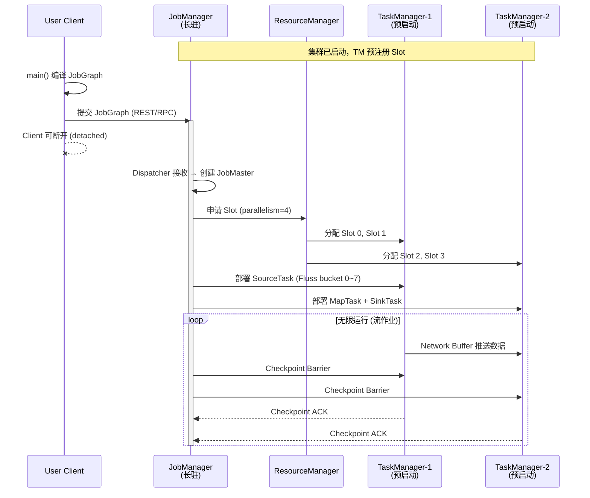
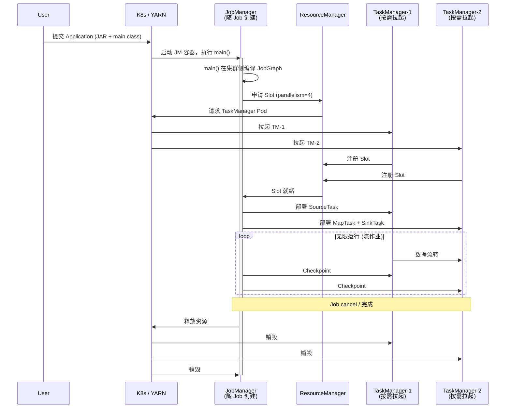
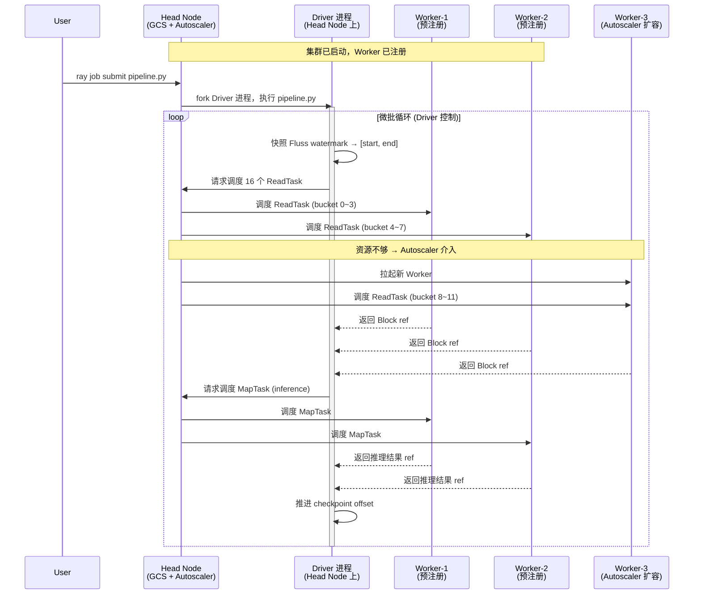

## 从读取 Fluss 全增量数据流看 Ray 与 Flink 的执行模型差异

### 引子：同一份数据，两种世界观

假设我们有一张 Fluss 表，16 个 bucket，每秒持续写入新数据。现在要把这份数据读出来做模型推理。用 Flink 和 Ray 分别接入时，你会发现两个框架在"谁来驱动读取"、"谁来管理并行"、"计算单元活多久"这三个根本问题上给出了完全不同的答案。

这篇文章不打算做功能清单式对比，而是沿着一条完整的数据链路——**Fluss bucket → 切分 → 并行读取 → 推理 → 输出**——逐层展开两套执行模型的差异。

---

### 一、Job 的提交与执行入口

下面三张时序图分别展示 Flink Session Mode、Flink Application Mode 和 Ray 提交作业时各组件间的交互。注意观察"谁编译 JobGraph"、"谁的生命周期绑定 Job"以及"计算节点何时存在"这三个关键差异。

#### 图 1：Flink Session Mode（共享集群，多 Job 复用）



**特征**：Client 侧编译 JobGraph → 提交后退出；JM + TM 生命周期独立于 Job；多个 Job 共享同一组 TM。

#### 图 2：Flink Application Mode（独占集群，Job 结束即销毁）



**特征**：main() 在集群侧执行（不在 Client）；TM 按需拉起；Job 结束 → 整个集群销毁；完全隔离。

#### 图 3：Ray（Session 式共享集群 + Driver 常驻循环）



**特征**：Driver 常驻在 Head Node，是用户进程不是框架进程；每轮微批独立调度 Task；Worker 共享复用，Autoscaler 按需扩缩；没有内置 Checkpoint Coordinator。

---

#### 三种模式的关键差异一览

| 维度 | Flink Session Mode | Flink Application Mode | Ray |
|------|-------------------|----------------------|-----|
| **JobGraph 编译位置** | Client 侧 | 集群侧（JM 容器内） | 集群侧（Driver 进程内） |
| **集群与 Job 生命周期** | 解耦（集群长驻） | 绑定（Job 完集群销毁） | 解耦（集群长驻） |
| **计算节点何时存在** | 预启动 | 按需拉起 | 预启动 + Autoscaler 弹性 |
| **多 Job 隔离** | 弱（共享 TM） | 强（独占集群） | 弱（共享 Worker） |
| **协调者 HA** | JM leader election（ZK/K8s） | 同左 | 单 Head Node，靠 Pod 重启 + Redis |
| **最像 Ray 的** | ✅ Session Mode ≈ Ray 默认 | ❌ Ray 没有等价物 | — |

可以看到：**Ray 的默认运行模式本质上就是 Flink Session Mode 的翻版**——都是长驻集群 + 多 Job 共享 + 弱隔离。而 Flink 为了解决隔离问题额外演化出了 Application Mode；Ray 则把这个问题留给了 K8s 层面（每个 Job 独立创建一个 `RayCluster` CR）。

---

下面展开每种模式的细节：

#### Flink：一次提交，永久运行

```
Client (main方法)
  │  构建 JobGraph
  └──► JobManager (Dispatcher接收 → JobMaster管理)
          │  部署 ExecutionGraph
          └──► TaskManager-0  [SourceTask: Fluss bucket 0~3]
          └──► TaskManager-1  [SourceTask: Fluss bucket 4~7]
          └──► TaskManager-2  [MapTask: inference]
          └──► ...
```

Client 进程的职责在**提交完成后即结束**（detached 模式）。它把用户代码编译成 JobGraph 交给 JobManager，此后 Client 可以断开连接。Job 的生命周期完全托管给 JobManager——你关掉笔记本电脑，作业照跑不误。

JobManager 内部由三个角色协作：ResourceManager 管资源、Dispatcher 管提交入口、JobMaster 管单个 Job 的执行。对于 Fluss 这种无界流 Source，JobMaster 会一直维持 SourceTask 的运行状态，直到用户主动 cancel 或触发 failover。

#### Ray：Driver 常驻，微批循环

```
Driver 进程 (长驻 Python 脚本)
  │
  │  while True:
  │    ① 快照 Fluss high-watermark → 确定本轮终点
  │    ② ray.data.read_datasource(FlussDatasource(start, end))
  │    │     └──► Worker-0 [ReadTask: bucket 0~3, offset 100→200]
  │    │     └──► Worker-1 [ReadTask: bucket 4~7, offset 50→180]
  │    ③ ds.map_batches(model_inference)
  │    │     └──► Worker-0 [MapTask: batch-0]
  │    │     └──► Worker-2 [MapTask: batch-1]
  │    ④ ds.write_datasink(sink)
  │    ⑤ update_checkpoint(new_offsets)
  │    ⑥ sleep(interval)
```

Ray 没有一个独立的"作业管理服务"。Driver **本身就是协调者**——它是一个普通 Python 进程，跑在 Head Node 上，通过 Ray Core API 向集群提交 Task/Actor。关键区别：Driver 不会"提交完就退出"，它在整个数据处理周期内保持存活，循环地创建新的 `read_datasource` 调用。

每一轮循环就是一个**有界微批**：锁定 offset 区间 → 并行读取 → 并行计算 → 写出 → 推进 checkpoint。Ray Data 的 `get_read_tasks()` 被调用一次返回固定的 `List[ReadTask]`，不存在"运行中追加新 task"的能力。

**核心差异**：Flink 的 JobManager 是一个框架级服务（独立进程，可 HA），管理着一个持续运行的有状态 DAG；Ray 的 Driver 是用户自己的代码进程，管理着一串短命的无状态批作业。

---

### 二、JobManager vs Driver：调度者的本质不同

|  | Flink JobManager | Ray Driver |
|--|-----------------|------------|
| **进程身份** | 框架管理进程，独立于用户代码 | 用户的 Python 脚本本身 |
| **生命周期** | 作业存活期间常驻，可 HA failover | 用户进程存活期间常驻，挂了就挂了 |
| **调度粒度** | 一次性部署完整 ExecutionGraph，此后只做 failover 重调度 | 每轮微批重新创建 task，每轮都是全新调度 |
| **状态管理** | 内置 Checkpoint Coordinator，周期性触发分布式快照 | 无内置机制，用户自己在循环末尾持久化 offset |
| **与计算节点关系** | JobMaster ↔ TaskManager 有心跳/背压/watermark 协议 | Driver → Worker 只有"提交 task + 拿结果"的 RPC |
| **失败恢复** | 从最近 checkpoint 自动恢复全图 | Driver 重启后从外部 checkpoint 手动恢复 |

Flink 的 JobManager 更像一个**数据库的 Query Coordinator**——它理解整个执行计划的拓扑，知道哪个 operator 在哪个 slot 上，知道数据在算子间怎么流转，能做全局优化（如 operator chaining、slot sharing）。

Ray 的 Driver 更像一个**编排脚本**——它不理解 task 之间的数据依赖（那是 Ray Data 内部 streaming executor 的事），它只负责"何时启动下一轮"和"用什么参数"。

---

### 三、TaskManager vs Worker：执行容器的形态

#### Flink TaskManager

```
TaskManager JVM 进程
├── Slot 0: [SourceTask] FlussSourceFunction → bucket 0~3
│            └── 持有 state backend handle
│            └── 响应 checkpoint barrier
├── Slot 1: [MapTask] InferenceOperator
│            └── 加载 ML 模型到 heap
│            └── 与上游 Slot 0 建立 Netty channel
├── Slot 2: [SinkTask] PaimonSinkFunction
│            └── 持有 commit 事务状态
└── Network Buffer Pool (共享)
```

TaskManager 是一个**长驻 JVM 进程**，内部通过 Task Slot 划分资源。每个 Slot 持有固定比例的 managed memory（堆外），但共享 CPU 和网络缓冲区。一旦 Job 部署，Slot 中的 Task 会**持续运行**直到 Job 结束——对于流作业，这意味着 SourceTask 会无限循环 poll Fluss log。

关键特性：同一 Job 的不同算子可以通过 **Slot Sharing** 共存于同一 Slot 内，形成一条完整的 pipeline（Source → Map → Sink 在一个线程链里）。这减少了网络序列化开销。

#### Ray Worker

```
Worker 进程 (Python)
├── [当前 Task] read_fluss_bucket_0_3(start=100, end=200)
│              └── 执行完毕 → 结果存入 Object Store → Worker 空闲
│
├── [下一个被调度的 Task] map_batch_inference(block_ref)
│              └── 从 Object Store 拉取 block → 推理 → 存回 → 空闲
│
└── Object Store (本节点共享内存)
```

Ray Worker 是一个**通用执行容器**，不绑定特定的算子或 Job。它从集群调度器获取 Task → 执行 → 返回结果 → 等待下一个 Task。每个 Task 是短命的、无状态的——执行完就释放资源。数据不在 Worker 间直接流转，而是通过共享内存 Object Store 中转。

如果需要有状态的长驻计算（如持有 GPU 上的模型），Ray 用 **Actor** 而非 Task：

```python
@ray.remote(num_gpus=1)
class InferenceActor:
    def __init__(self):
        self.model = load_model()  # Actor 创建时加载一次

    def predict(self, batch):
        return self.model(batch)   # 每次调用复用已加载的模型
```

Actor 的生命周期由创建者控制——Driver 可以创建一组 Actor 复用于多轮微批，也可以每轮重建。

---

### 四、正确的概念映射：资源容器层 vs 计算单元层

初学者常把 Flink Task Slot 和 Ray Task 对比，但这其实是错位的——它们不在同一层。正确的映射应该分两层来看：

#### 第一层：资源容器（谁提供执行环境）

```
Flink Task Slot  ←→  Ray Worker 进程
```

| | Flink Task Slot | Ray Worker |
|--|--|--|
| **本质** | TaskManager 内存的一个切片 | 集群中的一个独立 Python 进程 |
| **职责** | 为 Task 提供 managed memory + 线程 | 为 Task/Actor 提供 CPU/GPU/内存 |
| **生命周期** | 与 TaskManager 同寿 | 与 Worker 进程同寿 |
| **多租能力** | 通过 Slot Sharing 让同 Job 不同算子共享一个 Slot | 可串行/并行运行多个 Task，或长驻一个 Actor |
| **资源隔离** | Managed memory 隔离，CPU 不隔离 | 逻辑 resource request，无物理隔离 |

两者都是"给计算单元提供执行环境的容器"——Task/Actor 在里面跑，容器本身不执行业务逻辑。

#### 第二层：计算单元（谁执行业务逻辑）

```
Flink Task (Subtask)  ←→  Ray Task（无状态场景）/ Ray Actor（有状态场景）
```

| | Flink Task (流作业) | Ray Task | Ray Actor |
|--|--|--|--|
| **本质** | 一个算子实例，持续处理数据流 | 一次远程函数调用 | 一个远程有状态对象 |
| **状态** | 有（operator state + keyed state） | 无 | 有（对象内部属性） |
| **生命周期** | 与 Job 同寿（流=永久运行） | 执行完即销毁（秒级） | 由创建者控制（可跨多轮） |
| **Checkpoint** | 框架自动快照到 State Backend | 无 | 无框架级支持 |

更准确地说：

- Flink **流 Task**（如 FlussSourceTask，永久运行 + 持有 state） ≈ **Ray Actor**（长驻 + 持有内部状态）
- Flink **批 Task**（跑完一批数据就结束） ≈ **Ray Task**（执行完即销毁）

#### 生命周期错位：核心分歧

两层映射都成立，但生命周期的**绑定方式**完全不同——这才是根本差异：

```
Flink 流作业：

TaskManager ━━━━━━━━━━━━━━━━━━━━━━━━━━━━━━━━━━━━━━━► (长驻)
  Slot 0   ━━━━━━━━━━━━━━━━━━━━━━━━━━━━━━━━━━━━━━━► (与 TM 同寿)
    Task   ━━━━━━━━━━━━━━━━━━━━━━━━━━━━━━━━━━━━━━━► (与 Job 同寿=永久)
           ↑ 部署                                      ↑ cancel

Ray 微批循环：

Worker     ━━━━━━━━━━━━━━━━━━━━━━━━━━━━━━━━━━━━━━━► (长驻)
  Task          ━►    ━►    ━►    ━►    ━►           (每个只活几秒)
  Actor    ━━━━━━━━━━━━━━━━━━━━━━━━━━━━━►           (由 Driver 控制)
```

Flink 中 **Slot、Task、Job 三者命运绑定**——Slot 分给 Task 后就被 Task "占住"了，直到 Job 结束。这像是"分配了一间办公室，员工搬进去就不走了"。

Ray 中 **Worker 和 Task 完全解耦**——Task 执行完 Worker 就空闲，等待下一个 Task（可能来自不同 Job）。这像是"共享工位，做完手头的活就让给下一个人"。只有 Actor 模式下才出现类似 Flink 的"长期占住"行为。

#### 用 Fluss 读取场景具体化

**Flink 侧**：

```
Slot 0 ← SourceTask (Fluss bucket 0~3)
         │
         ├── 持有 offset 作为 operator state
         ├── 永久运行：poll → emit → poll → emit...
         ├── 响应 Checkpoint Barrier → 持久化 offset
         └── 挂了 → JM 从 checkpoint 恢复 → 同一 Slot 重建 Task → 续跑
```

一个 Task 的生命 = 整个流作业的生命。Task 和 Slot 是**长期婚姻**。

**Ray 侧**：

```
Worker-1 ← ReadTask (bucket 0~3, offset 100→200)
           │
           ├── 无 state，只读指定区间
           ├── 读完 → 结果存 Object Store → Task 销毁 → Worker 空闲
           └── 下一轮 Driver 循环 → 新的 ReadTask 被调度到 Worker-1（或任意 Worker）

Worker-2 ← InferenceActor (长驻，持有 GPU 模型)
           │
           ├── 跨多轮微批复用
           ├── 每轮接收 map_batches 调用 → 推理 → 返回结果
           └── 模型状态在 Actor 内存中保持
```

ReadTask 和 Worker 是**一次性约会**——做完就散。InferenceActor 和 Worker 才是**长期关系**——但这个关系是用户代码建立的，不是框架强制的。

#### 映射总表

| Flink 概念 | 最接近的 Ray 概念 | 相似点 | 关键差异 |
|-----------|----------------|-------|---------|
| TaskManager | Ray Node（Worker 节点） | 物理执行节点 | TM 是 JVM 进程，Worker 是 Python 进程 |
| Task Slot | Worker 进程 | 资源容器，给计算单元提供执行环境 | Slot 是 TM 内的内存切片；Worker 是独立进程 |
| Task/Subtask（流） | Actor | 有状态、长驻、持续处理数据 | Flink Task 有框架级 checkpoint；Actor 无 |
| Task/Subtask（批） | Task | 跑完就结束、无需长驻 | Flink 批 Task 仍可有 state；Ray Task 严格无状态 |
| Operator Chaining | Actor 内多步逻辑 | 减少序列化，一个执行单元串联多步 | Flink 是框架自动 chain；Ray 要用户手动写在 Actor 里 |
| Slot Sharing | Worker 内多 Actor 共存 | 多个计算单元共享一个容器的资源 | Flink 限同 Job；Ray 的 Worker 可跑不同 Job 的 Task |

---

### 五、数据流转机制：Push vs Pull

#### Flink：Operator 间持续 Push

```
SourceTask ──(Network Buffer)──► MapTask ──(Network Buffer)──► SinkTask
              背压信号 ◄──                  背压信号 ◄──
```

Flink 在算子间建立**持久的网络通道**（基于 Netty），数据以 buffer 为单位从上游 push 到下游。当下游处理不过来时，credit-based 背压机制会逐级传导到 Source，让 Source 减慢 poll 速率。整条 pipeline 是一个**共享命运的有状态流**——任何一个算子故障都会触发全图重启。

#### Ray Data：Object Store 中转 + Streaming Executor 调度

```
ReadTask-0 → [Block ref 存入 Object Store]
                     ↓
         Streaming Executor (Driver 侧) 调度下一个 Operator
                     ↓
MapTask-0 ← [从 Object Store 拉取 Block ref]
         → [结果 Block ref 存入 Object Store]
                     ↓
WriteTask-0 ← [拉取 Block ref]
```

Ray Data 的 Streaming Executor 跑在 Driver 进程中，它**只操纵 block 的引用**（metadata），不搬运实际数据。实际数据存活在各 Worker 节点的共享内存 Object Store 中。Executor 的调度循环：等 task 产出 → 把输出 ref 放入下一个 operator 的输入队列 → 选择"输出队列最短"的 operator 分配新输入。

背压机制：当 Object Store 缓冲量达到阈值，Executor 停止启动新的 ReadTask，等下游消费掉已有 block 后再继续。如果溢出，Ray Core 会把 object spill 到磁盘。

**核心差异**：Flink 是算子间**点对点 push**，数据不落地（除非 spill）；Ray 是**经由 Object Store 的间接 pull**，算子间解耦但多一次内存拷贝。

---

### 六、Fluss 全增量读取：两套实现的全貌

#### Flink 实现（原生流）

```java
FlinkSourceFunction<RowData> source = FlussSource.<RowData>builder()
    .setBootstrapServers("fluss-cluster:9123")
    .setTable("db.user_events")
    .setStartupMode(StartupMode.INITIAL)  // 先全量快照，再增量 log
    .setDeserializer(new RowDataDeserializer(schema))
    .build();

DataStream<RowData> stream = env.fromSource(source, WatermarkStrategy.forBoundedOutOfOrderness(...), "fluss-source");
stream.map(new InferenceFunction()).sinkTo(paimonSink);
env.execute();  // 提交后 Client 退出，Job 永久运行
```

运行时拓扑：

```
JobManager
  └── JobMaster: 管理 ExecutionGraph
         ├── SourceTask×4 (各自持有 bucket 分配 + offset state)
         │     └── Snapshot Reader: 全量扫描 → 输出历史数据
         │     └── Log Reader: 全量完成后切换到增量消费
         ├── MapTask×4 (InferenceFunction, 持有模型)
         └── SinkTask×2 (Paimon commit, 持有事务 state)
```

全量→增量切换是 **Source 内部的状态机**，对 JobManager 透明。Checkpoint 同时快照所有 Task 的 state（包括 Source 的 offset + Sink 的事务），保证 exactly-once。

#### Ray 实现（微批模拟）

```python
import ray
from fluss_ray import FlussBoundedDatasource, load_checkpoint, save_checkpoint

ray.init(address="auto")
offsets = load_checkpoint()  # 从外部存储恢复上次位点

while True:
    # ① 锁定本轮终点
    watermarks = fluss_client.get_high_watermarks("db.user_events")
    if watermarks == offsets:
        time.sleep(5)
        continue

    # ② 有界读取
    ds = ray.data.read_datasource(
        FlussBoundedDatasource(table="db.user_events", start=offsets, end=watermarks),
        override_num_blocks=16,
    )

    # ③ 推理（复用 Actor pool 避免重复加载模型）
    ds = ds.map_batches(
        InferenceModel,
        compute=ray.data.ActorPoolStrategy(min_size=4, max_size=8),
        num_gpus=1,
    )

    # ④ 写出
    ds.write_datasink(PaimonDatasink(...))

    # ⑤ 推进 checkpoint
    save_checkpoint(watermarks)
    offsets = watermarks
```

运行时拓扑（单轮）：

```
Driver (常驻)
  ├── Streaming Executor: 管理本轮 DAG
  │     ├── ReadTask×16 (短命, 各读一段 offset 区间, 无 state)
  │     ├── InferenceActor×4~8 (长驻 Actor pool, 持有 GPU 模型)
  │     └── WriteTask×N (短命, 写 Paimon)
  └── 本轮结束 → checkpoint → 下一轮重复
```

全量读取 = 第一轮 `start=0, end=current_watermark`（可能数据量大，多轮分页）；之后每轮只读增量 delta。切换逻辑在 **Driver 的循环控制里**，不在框架内部。

---

### 七、总结：什么时候选谁

| 维度 | Flink | Ray Data |
|------|-------|----------|
| **适合场景** | 持续低延迟流处理（ms~s 级）、需要 exactly-once 语义 | 大规模批推理、GPU 密集型 ML pipeline、弹性微批 |
| **Fluss 全增量** | 原生支持，Source 内部状态机处理切换 | 需自行实现微批循环 + offset 管理 |
| **延迟** | 毫秒级端到端 | 受限于微批间隔（通常秒~分钟级） |
| **GPU 利用率** | 不擅长（JVM 生态，GPU 支持弱） | 原生支持，Actor pool 长驻 GPU |
| **容错** | 框架级 checkpoint，自动恢复 | 用户级 checkpoint，手动恢复 |
| **资源效率** | Slot 预分配，资源利用率受 parallelism 配置影响 | Task 按需调度，Autoscaler 弹性伸缩 |
| **编程模型** | 声明式 DAG（定义拓扑，框架执行） | 命令式脚本（你写循环，你控制节奏） |

一句话概括：**Flink 是"你告诉我要什么，我永远帮你跑着"；Ray 是"你每次告诉我跑一趟，跑完我就歇了"。** 前者是 always-on 的有状态引擎，后者是 on-demand 的无状态计算池。对于 Fluss 这种无界流数据源，Flink 是天然匹配；Ray 则需要你自己在外层补齐"持续性"和"状态管理"这两块拼图——但换来的是对 GPU 调度和 ML workload 的一等公民支持。
